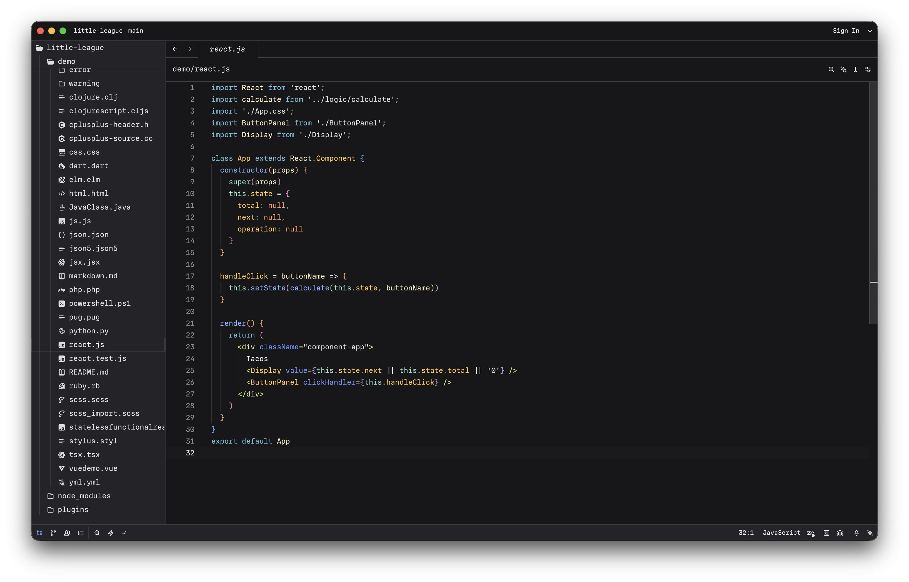

# Little League

A quiet theme with harmonious colors. Three variants: Dark, Darker, and Light.



Available for:
- **[VS Code](https://marketplace.visualstudio.com/items?itemName=matthewstrom.little-league)** — full editor theme with syntax highlighting
- **[Zed](https://zed.dev)** — full editor theme with syntax highlighting
- **iTerm** — terminal color scheme
- **Ghostty** — terminal color scheme

## Installation

### VS Code
Search for "Little League" in the Extensions panel, or install from the [Marketplace](https://marketplace.visualstudio.com/items?itemName=matthewstrom.little-league).

### Zed
Install from the Zed extension store, or for development: open the command palette and run "zed: install dev extension" pointing to `targets/zed/`.

### iTerm
Import from `targets/iterm/` — drag any `.itermcolors` file into iTerm's color preferences.

### Ghostty
Copy theme files to Ghostty's config directory:
```bash
cp targets/ghostty/* ~/.config/ghostty/themes/
```
Then set `theme = "Little League Dark"` in your Ghostty config.

## Development

Design tokens are stored in OKLCH color space using the [DTCG](https://www.designtokens.org/) specification, and compiled to all target formats via [Terrazzo](https://terrazzo.ds).

```bash
npm install
npm run build       # Build all targets
npm run test        # Build and verify outputs match committed snapshots
npm run watch       # Rebuild on token changes
```

See [CLAUDE.md](CLAUDE.md) for detailed architecture documentation.

## License

MIT
