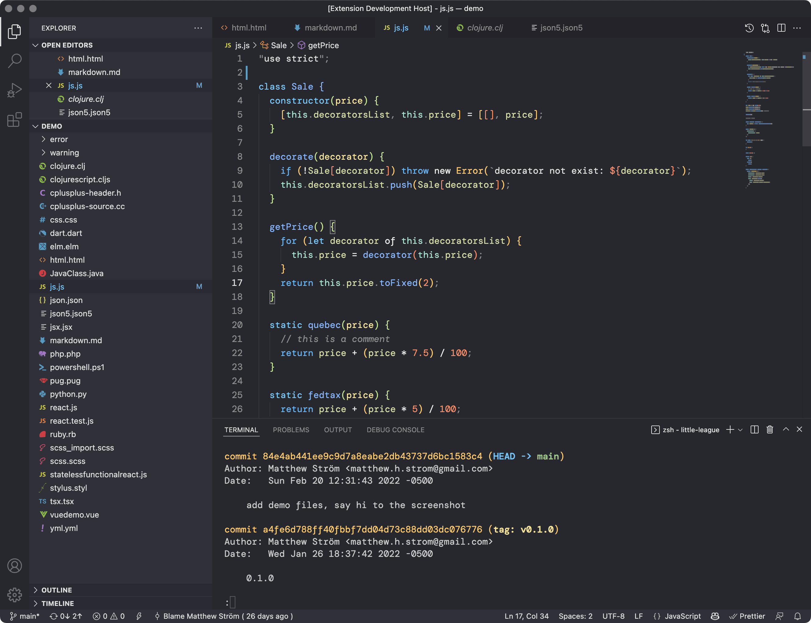
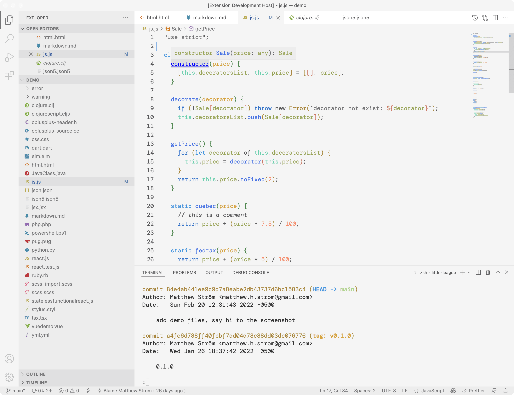

# Little League VSCode Theme
[![Version]](https://vsmarketplacebadge.apphb.com/version/matthewstrom.little-league.png) [![Downloads]](https://vsmarketplacebadge.apphb.com/downloads/matthewstrom.little-league.png) [![Rating]](https://vsmarketplacebadge.apphb.com/rating/matthewstrom.little-league.png)
[View on VS Code Marketplace](https://marketplace.visualstudio.com/items?itemName=matthewstrom.little-league) | [Preview in vscode.dev](https://vscode.dev/theme/matthewstrom.little-league)

 ⚾ A quiet theme with harmonious colors.

## Installation

1. Install [Visual Studio Code](https://code.visualstudio.com/)
1. Launch Visual Studio Code
1. Choose **Extensions** from menu
1. Search for `Little League`
1. Click **Install** to install the extension
1. Click **Reload** to reload VS Code
1. From the menu bar click: Code > Preferences > Color Theme > **Little League Dark**

## Motivation

I wanted to create a color theme to explore the potential of using design tokens to unify design systems across apps. The goal is to eventually tie this theme to the design system of [my website](https://matthewstrom.com) using a design API.

A secondary goal was to create a color theme that minimizes the use of red — I find that looking at colors like blue, green, and yellow make me feel more calm when debugging code :)

## Thanks

A huge thanks goes to [Sarah Drasner](https://twitter.com/sarah_edo) for sharing her knoweldge on how to create a VSCode theme. The first versions of the theme were done entirely from her tutorial on [CSS Tricks](https://css-tricks.com/creating-a-vs-code-theme/).

An equally huge thanks to [Danny Banks](https://twitter.com/dbanksDesign). First, for [Style Dictionary](https://github.com/amzn/style-dictionary), which makes it a breeze to build VSCode themes from design tokens. Second, the [Nu Disco](https://github.com/dbanksdesign/nu-disco-vscode-theme) theme served as a template for the 1.0 version of this theme — all of the demo files come from that repo.

